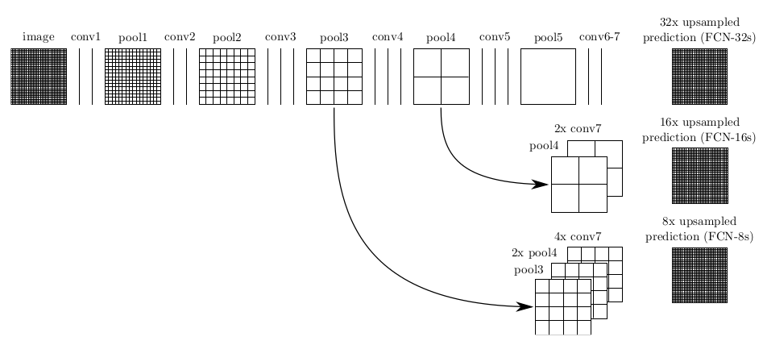
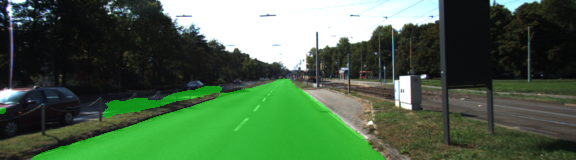
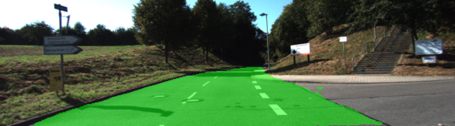
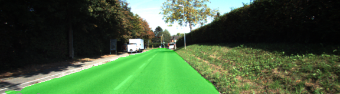
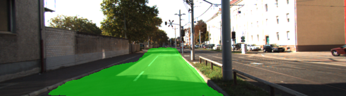
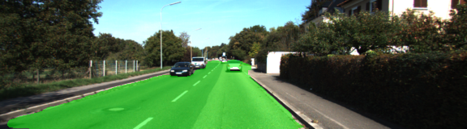
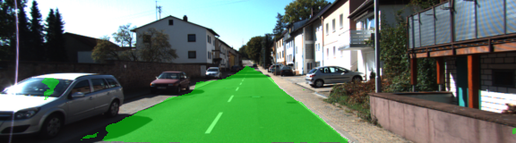
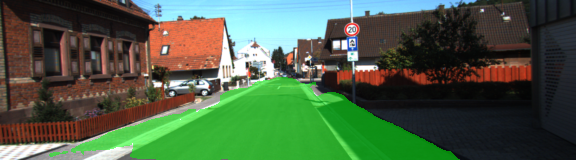
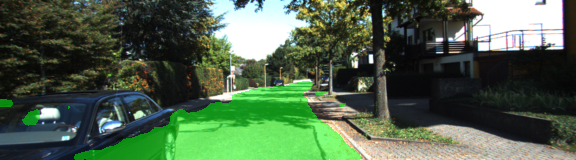

# Semantic Segmentation
### Introduction
In this project, I labeled the pixels of a road in images using a Fully Convolutional Network (FCN).

### Setup
#### GPU
I have a Nvidia GTX 1080TI GPU on my system.

#### Development Environment
I use following steps to install develop environment.
 - First I installed CUDA and GPU driver.
 - Then I use a Docker enviroment which name is tensorflow:tensorflow-gpu as my development enviroment. 

You can see details [here](./Dockerfile) and running script [here](./run.sh). 

#### Frameworks and Packages
I have installed following Frameworks and Packages:
 - [Python 3](https://www.python.org/)
 - [TensorFlow](https://www.tensorflow.org/)
 - [NumPy](http://www.numpy.org/)
 - [SciPy](https://www.scipy.org/)

#### Dataset
Download the [Kitti Road dataset](http://www.cvlibs.net/datasets/kitti/eval_road.php) from [here](http://www.cvlibs.net/download.php?file=data_road.zip).  Extract the dataset in the `data` folder.  This will create the folder `data_road` with all the training a test images.

### Approach

#### Architecture
I use a FCN network with converting a pre-trained VGG-16 network as encoder. The fianl fully-connected layers are replaced by 1-by-1 convolutions. The depth was set equal to the number of desired classes (in this case, two: road and not-road).
Then I use `conv2d_transpose` to upsample the input to the original image size. Skip connections were added to improve perfomance.

You can see these codes in `layers` function in [main.py](./main.py)  (line 61 - line 80). 

The architecture is the same as the [FCN paper](https://people.eecs.berkeley.edu/~jonlong/long_shelhamer_fcn.pdf).

#### Optimizer
I use cross-entropy as loss function and Adam optimizer to minimize the loss.
You can see the detail in `optimize` function.

#### Training
I found that larger batch_size can make higher utilization of GPU. 
So, I used following  hyperparameters for training:
  - keep_prob: 0.8
  - learning_rate: 0.0001
  - epochs: 1000
  - batch_size: 32

You can see the detail in `train_nn` function.

#### Results
Loss at first epoch: 5.412
Loss after 1000 iterations: 0.009
On average, the model decreases loss over time.

#### Samples

Belows are some of sample images from the output of FCN, with the segmentation class overlaid upon the original image in green.

We can see that the solution that is close to best, would label at least 90% of the road and label no more than 10% of non-road pixels as road, which is over the criteria.

### Possible Improvements:
We can use a deeper model as encoder to replace with VGG-16, like ResNet.

### Submission
1. Ensure you've passed all the unit tests.
2. Ensure you pass all points on [the rubric](https://review.udacity.com/#!/rubrics/989/view).
3. Submit the following in a zip file.
 - `helper.py`
 - `main.py`
 - `project_tests.py`
 - Newest inference images from `runs` folder  (**all images from the most recent run**)
 
 ### Tips
- The link for the frozen `VGG16` model is hardcoded into `helper.py`.  The model can be found [here](https://s3-us-west-1.amazonaws.com/udacity-selfdrivingcar/vgg.zip)
- The model is not vanilla `VGG16`, but a fully convolutional version, which already contains the 1x1 convolutions to replace the fully connected layers. Please see this [forum post](https://discussions.udacity.com/t/here-is-some-advice-and-clarifications-about-the-semantic-segmentation-project/403100/8?u=subodh.malgonde) for more information.  A summary of additional points, follow. 
- The original FCN-8s was trained in stages. The authors later uploaded a version that was trained all at once to their GitHub repo.  The version in the GitHub repo has one important difference: The outputs of pooling layers 3 and 4 are scaled before they are fed into the 1x1 convolutions.  As a result, some students have found that the model learns much better with the scaling layers included. The model may not converge substantially faster, but may reach a higher IoU and accuracy. 
- When adding l2-regularization, setting a regularizer in the arguments of the `tf.layers` is not enough. Regularization loss terms must be manually added to your loss function. otherwise regularization is not implemented.